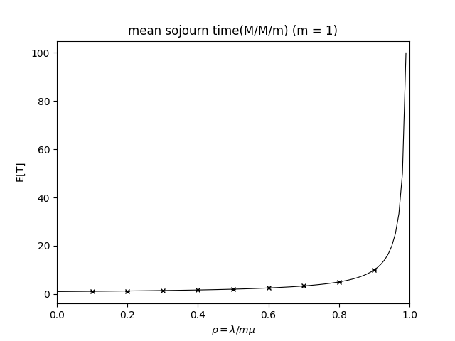

# M/M/m queue simulator
M/M/mの待ち行列のシミュレーションを行います. サーバ数(m)と標本数をコマンドライン引数で指定することで, シミュレーションによって得られた平均滞在時間とその信頼区間及びリトルの公式から得られる理論値のグラフを描画します.

# 利用方法
```
$python main.py -h     
usage: main.py [-h] [-s {11,21,51}] m

Simulate M/M/m queueing model. Output a graph of mean sojourn time obtained from simulation and Little's law.

positional arguments:
  m              the number of server

optional arguments:
  -h, --help     show this help message and exit
  -s {11,21,51}  the number of sample_size
```

# 出力例 (m = 1の時)

